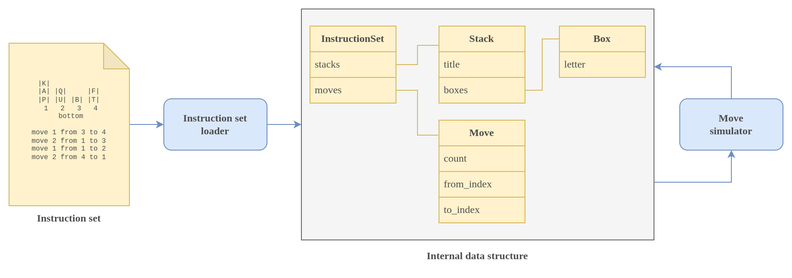

# HeavyLifter Simulator

## Architecture diagram

## Usage

Install the requirements:

    $ pip install -r requirements.txt

Run the simulator to see the usage:

    $ python heavy_lifter_simulator.py

Run the simulator with a given instruction set:

    $ python heavy_lifter_simulator.py doc/instruction_set_simple.txt
    Initial state:
     1: PAK
     2: UQ
     3: B
     4: TF

    Moved 1 box from 3 to 4:
     1: PAK
     2: UQ
     3:
     4: TFB

    Moved 2 boxes from 1 to 3:
     1: P
     2: UQ
     3: KA
     4: TFB

    Moved 1 box from 1 to 2:
     1:
     2: UQP
     3: KA
     4: TFB

    Moved 2 boxes from 4 to 1:
     1: BF
     2: UQP
     3: KA
     4: T

    Top boxes:
    FPAT

## Quality

100% coverage by pytest:

    $ pytest --cov

Type hints are verified by mypy:

    $ mypy .

Code quality is verified by ruff (equivalent of pycodestyle, pyflakes, flake8, isort and mccabe):

    $ ruff .

## Todo

Error handling needs to be implemented for verifying the instruction set file path and content.
